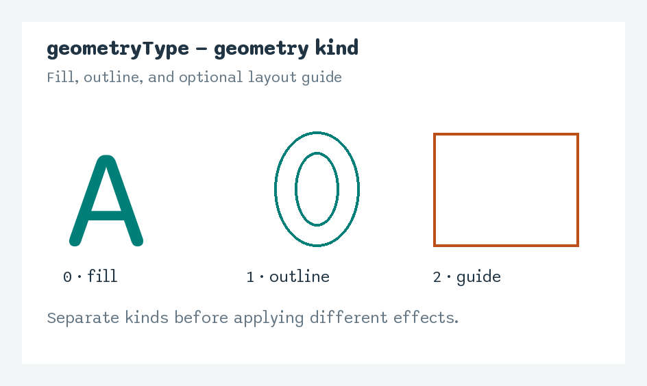
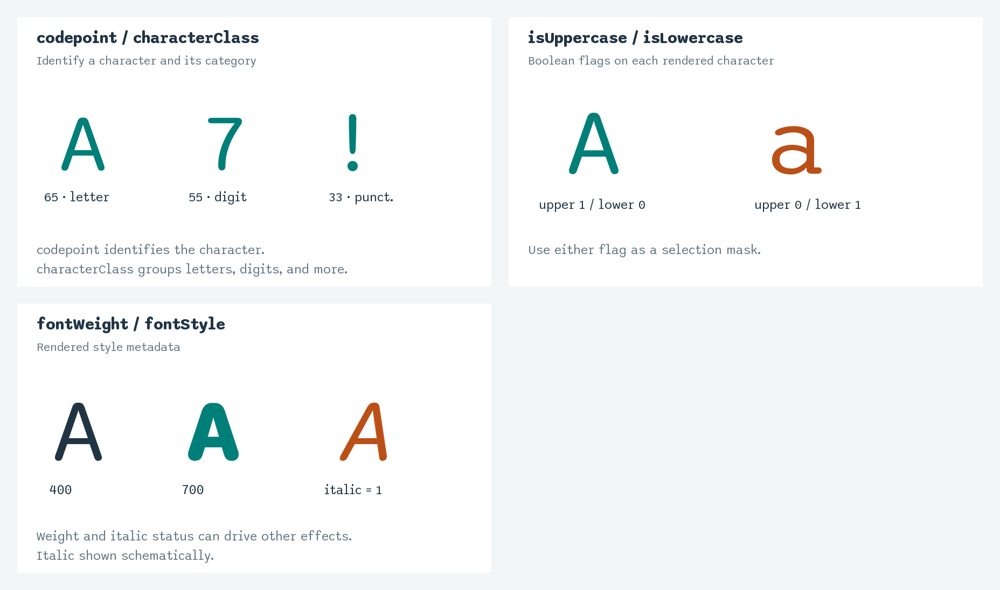
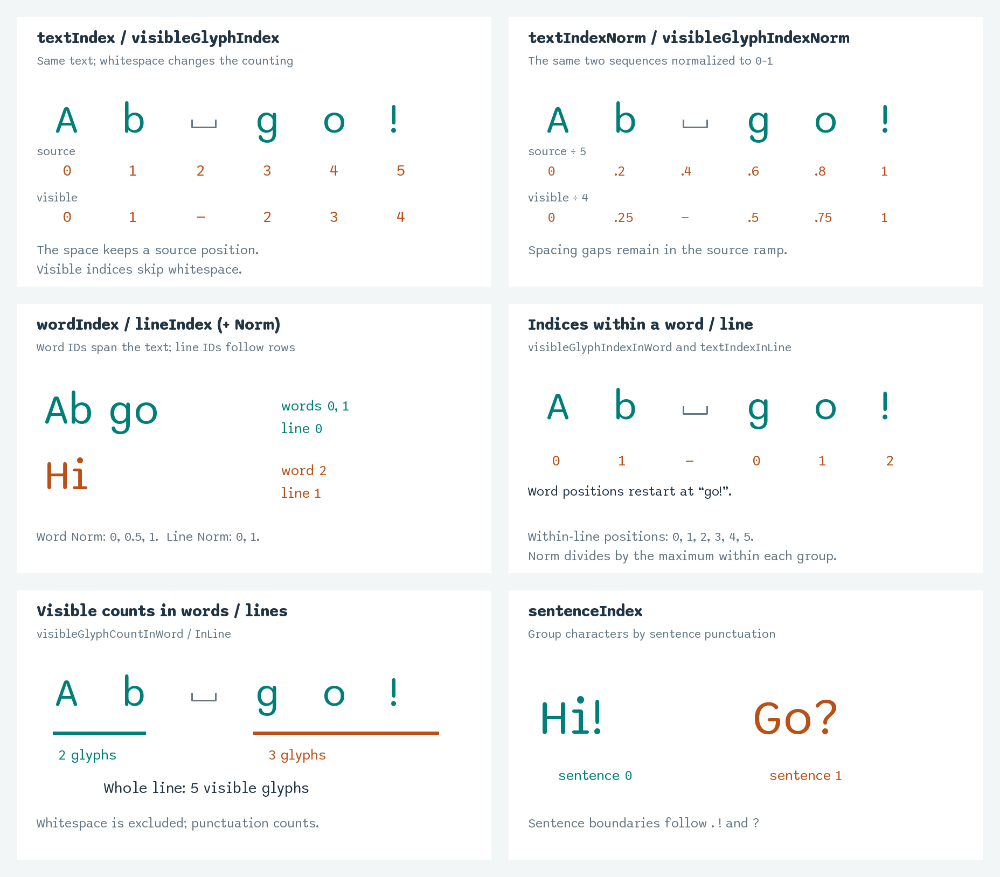
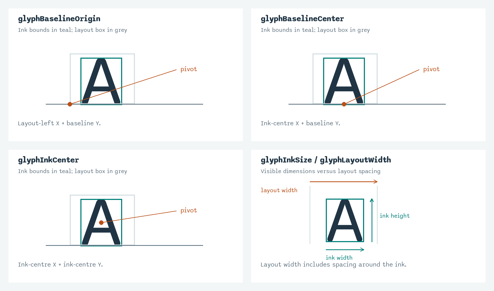
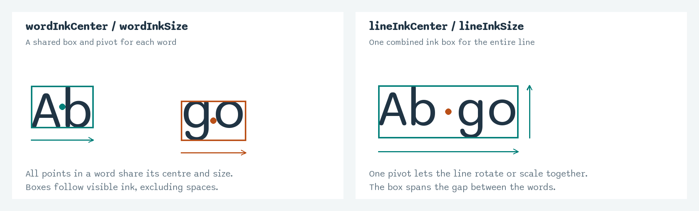
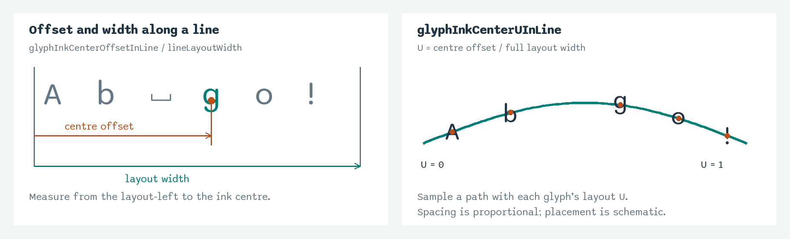
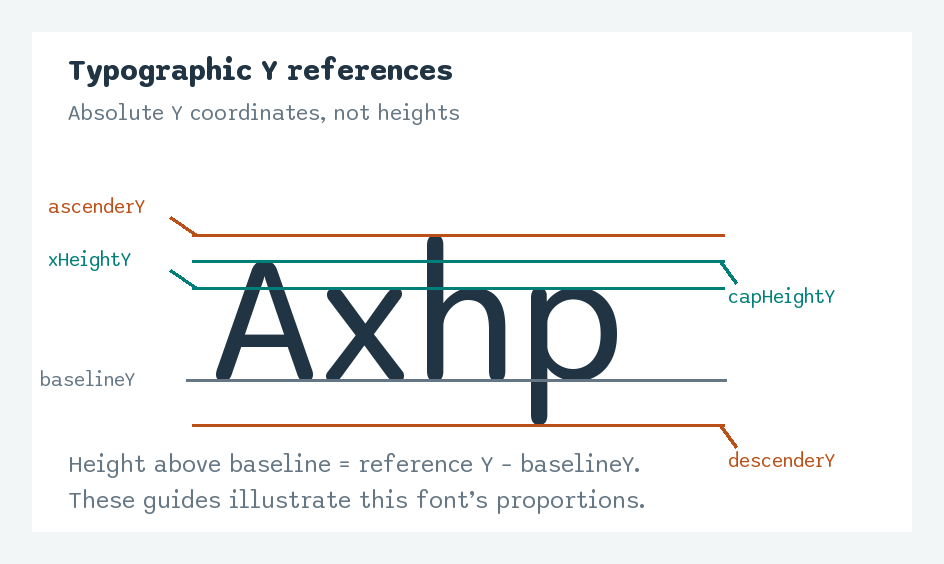
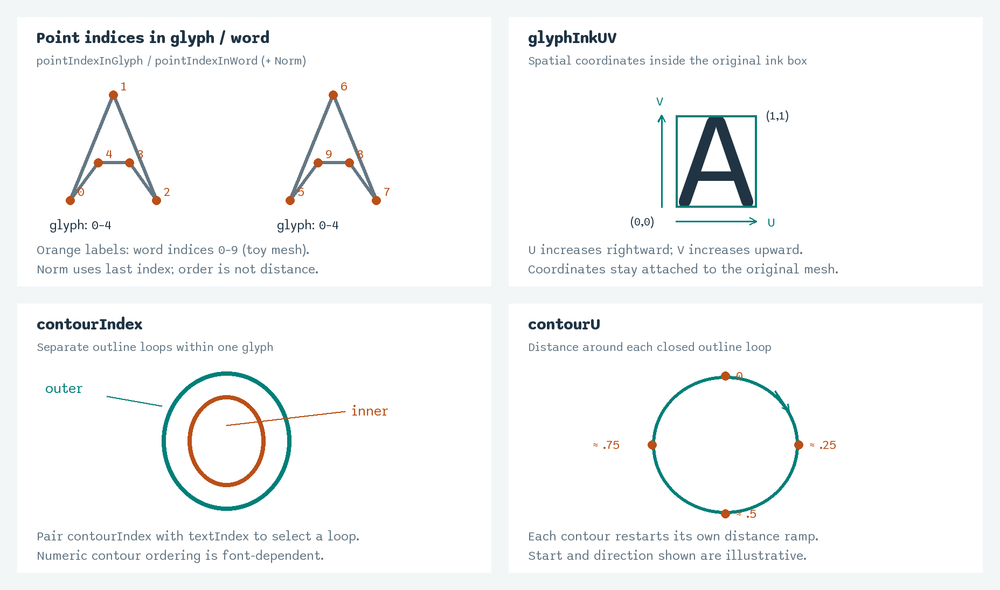

# POP attribute reference

This reference covers the 46 GTA-specific point attributes generated by
GeoTypeAdvanced's geometry Script POP. Standard position and colour attributes
are omitted. Typography metadata is shared by every point belonging to a glyph.
Positions and sizes use TouchDesigner units.

Use `out_type_data` for per-glyph control, and the surface or outline outputs for
geometry-point effects. The examples below describe downstream uses rather than
ready-to-paste expressions. Each section includes a grouped illustration. These
are explanatory diagrams, not TouchDesigner screenshots; spacing, mesh order,
and contour direction are schematic. A small bracket marks a space in the
sequence examples.

## Geometry kind

| Attribute | Description | Example use |
|---|---|---|
| `geometryType` | `0` = fill mesh, `1` = outline; the wrap-box guide uses `2`. | Separate filled letters from their outlines. |

## Character identity and styling

| Attribute | Description | Example use |
|---|---|---|
| `textIndex` | Character index in the full text sequence, retaining spaces and newline positions. | Give each character a sequence-based animation offset. |
| `codepoint` | Character's Unicode code point. | Select all occurrences of “A” using `65`. |
| `characterClass` | `0` = whitespace, `1` = letter, `2` = digit, `3` = punctuation, `4` = extended Unicode. | Give digits a different colour or motion. |
| `isUppercase` | `1` for an uppercase letter, otherwise `0`. | Make capital letters bounce higher. |
| `isLowercase` | `1` for a lowercase letter, otherwise `0`. | Apply an effect only to lowercase letters. |
| `fontWeight` | Rendered font weight, typically 100–900. | Drive extrusion depth from font weight. |
| `fontStyle` | `0` = normal, `1` = italic. | Apply a separate treatment to italic text. |

## Sequence and grouping

| Attribute | Description | Example use |
|---|---|---|
| `textIndexNorm` | Source character index normalized by the largest measured index; whitespace gaps remain. | Sweep an effect through the source text from 0–1. |
| `visibleGlyphIndex` | Contiguous index excluding whitespace, including punctuation. Whitespace metadata uses `-1`. | Reveal visible characters at evenly spaced time intervals. |
| `visibleGlyphIndexNorm` | Visible-character index normalized to 0–1; whitespace metadata uses `0`. | Distribute a colour gradient across visible characters. |
| `wordIndex` | Zero-based word index across the text. | Animate each word as a separate group. |
| `wordIndexNorm` | Word index normalized by the largest measured word index. | Progressively increase rotation across words. |
| `lineIndex` | Zero-based visual line index. | Offset alternate lines left and right. |
| `lineIndexNorm` | Line index normalized by the largest measured line index. | Blend colours from the first line to the last. |
| `textIndexInLine` | Character position within its line, including spaces. | Restart a character stagger on every line. |
| `textIndexInLineNorm` | Character position normalized within its line, retaining space positions. | Repeat a sequence-based reveal across each line. |
| `visibleGlyphIndexInWord` | Visible-character position within its word. | Animate the first character of every word. |
| `visibleGlyphIndexInWordNorm` | Visible-character position normalized within its word. | Repeat a gradient independently inside each word. |
| `sentenceIndex` | Sentence index, advancing at `.`, `!`, and `?`. | Reveal or colour the text sentence by sentence. |
| `visibleGlyphCountInWord` | Number of non-whitespace characters in the word, including punctuation. | Adjust animation duration to word length. |
| `visibleGlyphCountInLine` | Number of non-whitespace characters in the line, including punctuation. | Keep a line reveal's total duration consistent. |

## Glyph anchors and bounds

| Attribute | Description | Example use |
|---|---|---|
| `glyphBaselineOrigin` | XY: layout box's left edge and baseline Y. | Anchor a glyph at its original layout origin. |
| `glyphBaselineCenter` | XY: ink-centre X and baseline Y. | Rotate letters around their baseline centres. |
| `glyphInkCenter` | XY centre of the glyph's visible ink bounds. | Scale or spin each glyph around its centre. |
| `glyphInkSize` | XY width and height of the glyph's ink bounds. | Scale displacement relative to each glyph's size. |
| `glyphLayoutWidth` | Measured character layout width, retaining browser spacing behavior. | Construct character layout boxes. |

## Word and line bounds

| Attribute | Description | Example use |
|---|---|---|
| `wordInkCenter` | XY centre of the word's combined ink bounds. | Rotate a whole word around one shared pivot. |
| `wordInkSize` | XY width and height of the word's combined ink bounds. | Size a highlight rectangle around each word. |
| `lineInkCenter` | XY centre of the line's combined ink bounds, excluding whitespace. | Scale each line around its visual centre. |
| `lineInkSize` | XY width and height of the line's combined ink bounds. | Fit a background panel to each line's visible text. |

## Proportional layout and paths

| Attribute | Description | Example use |
|---|---|---|
| `glyphInkCenterOffsetInLine` | Horizontal distance from the line's layout-left edge to the glyph's ink centre. | Place letters along a path while retaining proportional spacing. |
| `glyphInkCenterUInLine` | That distance divided by `lineLayoutWidth`; zero for a zero-width layout. Not clamped. | Sample a path at each glyph's proportional position. |
| `lineLayoutWidth` | Full measured line layout width, including whitespace. | Fit the line's original layout onto a chosen path length. |

## Typographic reference lines

| Attribute | Description | Example use |
|---|---|---|
| `baselineY` | Absolute Y coordinate of the baseline. | Make letters grow upward from the baseline. |
| `xHeightY` | Absolute Y coordinate of the lowercase x-height reference. | Place a horizontal reveal through the lowercase body. |
| `capHeightY` | Absolute Y coordinate of the capital-height reference. | Align an effect to the tops of capitals. |
| `ascenderY` | Absolute Y coordinate of the ascender reference. | Position a guide above tall lowercase letters. |
| `descenderY` | Absolute Y coordinate of the descender reference. | Position an underline below descending letters. |

## Geometry-point and contour coordinates

| Attribute | Description | Example use |
|---|---|---|
| `pointIndexInGlyph` | Geometry-point index within its glyph. | Seed a different offset for each point of a letter. |
| `pointIndexInGlyphNorm` | Geometry-point index normalized within its glyph. | Apply a mesh-order colour ramp to each letter. |
| `pointIndexInWord` | Running geometry-point index across the word's glyphs. | Sequence point effects across a whole word. |
| `pointIndexInWordNorm` | Geometry-point index normalized within its word. | Spread a mesh-order effect across each word. |
| `glyphInkUV` | XY position normalized within the original glyph's ink bounds: left to right and bottom to top. | Reveal every letter from bottom to top using its Y component. |
| `contourIndex` | Outline contour identifier within a glyph; surface points use `0`. | Treat separate contours of “O” independently, paired with `textIndex`. |
| `contourU` | Normalized distance around an outline contour; restarts per contour. Surface points use `0`. | Animate a travelling highlight around each letter outline. |

## Usage notes

- **Ink excludes whitespace; layout retains spacing.** For proportional text
  along a path, use `glyphInkCenterUInLine` rather than a character-index ramp.
- **Y references are coordinates, not heights.** Capital height above the
  baseline is `capHeightY - baselineY`.
- **Point-index ramps follow mesh order, not physical distance.** Use
  `glyphInkUV` for spatial wipes and `contourU` for outline travel. Remeshing can
  change point-index values.
- **Single-element index ramps are zero.** Source index ramps retain internal
  whitespace gaps; trailing unmeasured newlines do not extend their range.
- **Contour sampling follows the font outline and mesh detail.** Start points
  and directions can differ between fonts. A duplicated closing endpoint reaches
  `contourU = 1`; otherwise the closing edge returns from the last value to zero.

See [Animation attributes](animation-attributes.md) for path-placement steps,
coordinate formulas, edge cases, and the migration table for previous names.

[Back to the GTA documentation](README.md)
